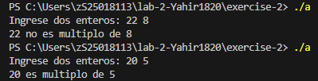
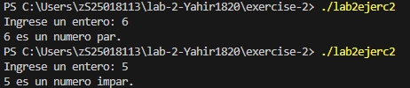

# Ejercicio de laboratorio 2 – Múltiplos

## Descripción

Escriba un programa que lea en dos números enteros y determine e imprima si el primero es un múltiplo del segundo. [Sugerencia: use el operador de módulo.]

```cmd
Ingrese dos enteros: 22 8
22 no es un múltiplo de 8
```

## Contesta las siguientes preguntas

1. ¿Se puede utilizar el operador de módulo con operandos no enteros? Si ¿Se puede usar con números negativos? Supongamos que el usuario ha introducido los siguientes conjuntos de números. Para cada serie, ¿qué produce en la tercera columna? Si hay un error, explique por qué.

   | Entero 1 | Entero 2 | Expresión        | Salida | Explicación                              |
   | -------- | -------- | ---------------- | ------ | ---------------------------------------- |
   | 73       | 22       | cout << 73 % 22; |    7   | No es multiplo                           |
   | 0        | 100      | cout << 0 % 100; |    0   | Si es un multiplo                        |
   | 100      | 0        | cout << 100 % 0; |  Error | Error al querer sacar el modulo por 0    |
   | -3       | 3        | cout << -3 % 3;  |    0   | Si es multiplo                           |
   | 9        | 4.5      | cout << 9 % 4.5; |  Error | % solo se usa con enteros                |
   | 16       | 2        | cout << 16 % 2;  |    0   | Si es multiplo                           |

2. ¿Qué pasa si colocamos un punto y coma (;) después del final de la expresión de condición de una declaración if? 
El punto y coma (;) terminaria con la declaración if, lo que causará error si hay otros if.

3. Modifique el programa para determinar si un número ingresado es par o impar. [Nota: Ahora, el usuario necesita ingresar solo un número.]

## ✅ Resultado
Programa si modificar



Programa modificado
